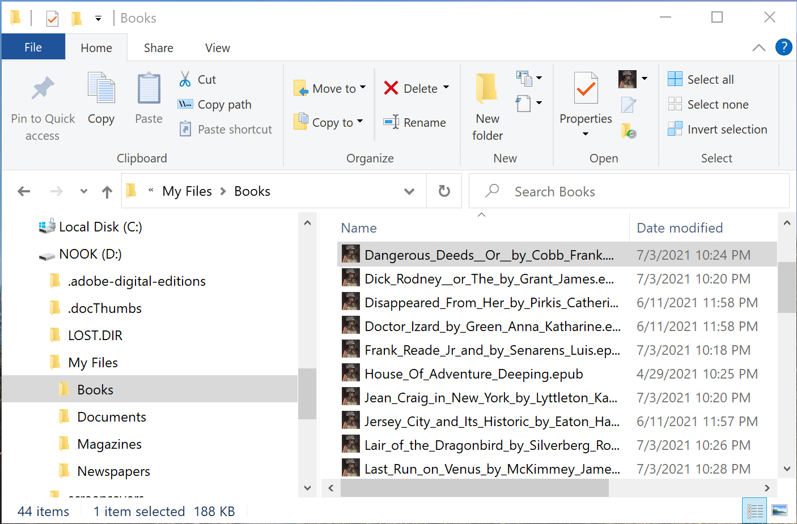
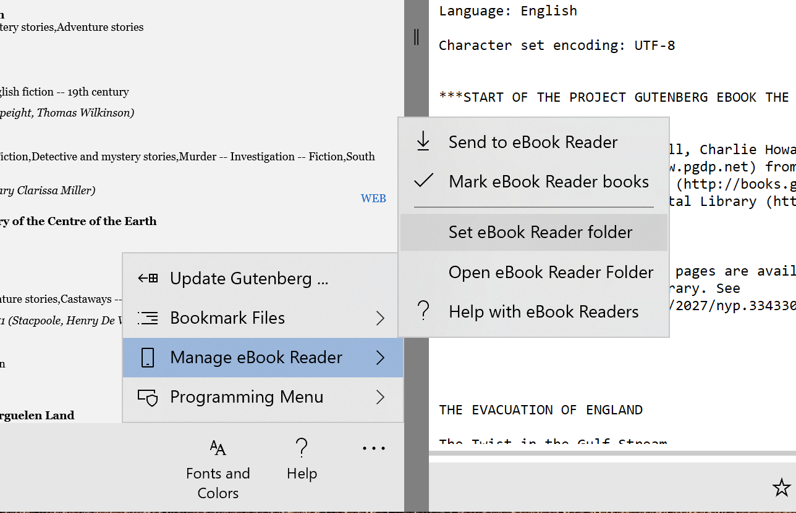
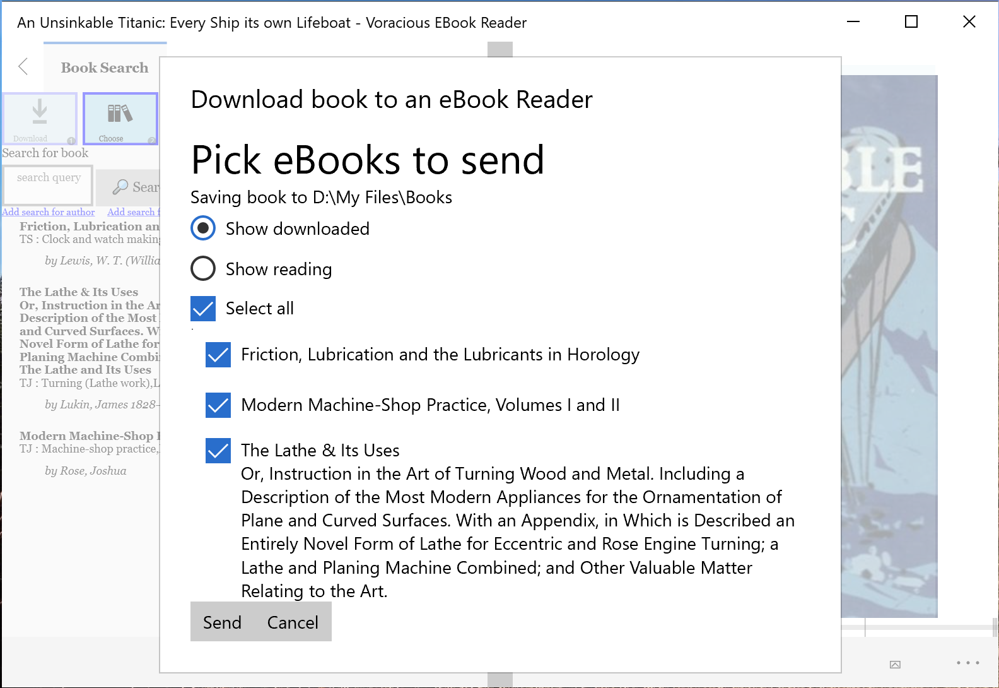
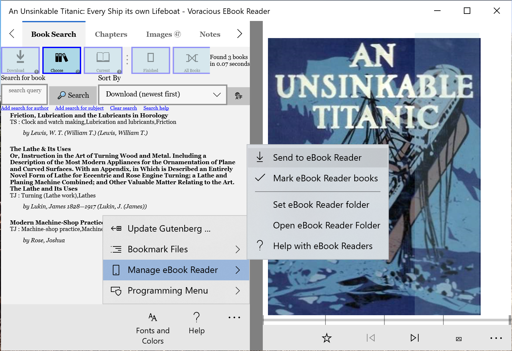

# Using an eBook Reader with Voracioius Reader

*Note:* this is an experimental feature. It will be altered based on user feedback.

## eBook Readers
Lightweight, rugged eBook Readers are a popular way to carry around a library's worth of books. The Voracious Reader has some limited ability to copy books you've downloaded onto your eBook Reader. When you are finished with the books, you can remove them from the reader, mark them done, and add in reviews. However, this operation is not as smooth as the rest of the Voracious Reader's capabilities.

Voracious Reader is able to work with any eBook Reader that can read EPUB files and where the eBook Reader shows up as an ordinary Disk Drive to Windows. This has been tested with some versions of the Barnes and Noble Nook device and may work with other brands as well.

## Setup

To use an eBook Reader with Voracious Reader, just follow these steps

1. Plug your eBook Reader into your computer via the USB cable.
2. Run Windows Explorer (**Windows-E**) and verify that your eBook Reader shows up as a device. It will often show up as a **D:** drive.
3. Find the directory with eBooks. On my device, this is in directory **My Files\Books**
4. In Voracious Reader, click on ... and from the pop-up menu select  Manage eBook Reader and Set eBook Reader Folder
5. Select the folder on the eBook Reader (step 3) that holds your eBook

## Send to eBook Reader

To send downloaded eBook files to your eBook Reader, you first have to download them. Its easiest if you don't read them in Voracious Reader first.

1. Make sure that your eBook Reader is connected to your computer
2. In Voracious Reader, **download** the eBooks that you want to read on your eBook Reader. In the example, I've downloaded three machine-shop eBooks. These will show up in the Choose list.
3. Send the books using the ... Manage eBook Reader --> Send to eBook Reader menu
4. In the pop-up dialog, pick the books to download. This starts by showing all of the books you've downloaded to Voracious Reader and which you haven't started reading. Then press **Send**
5. 

